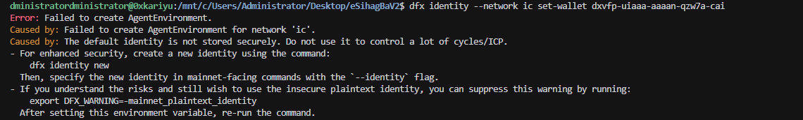
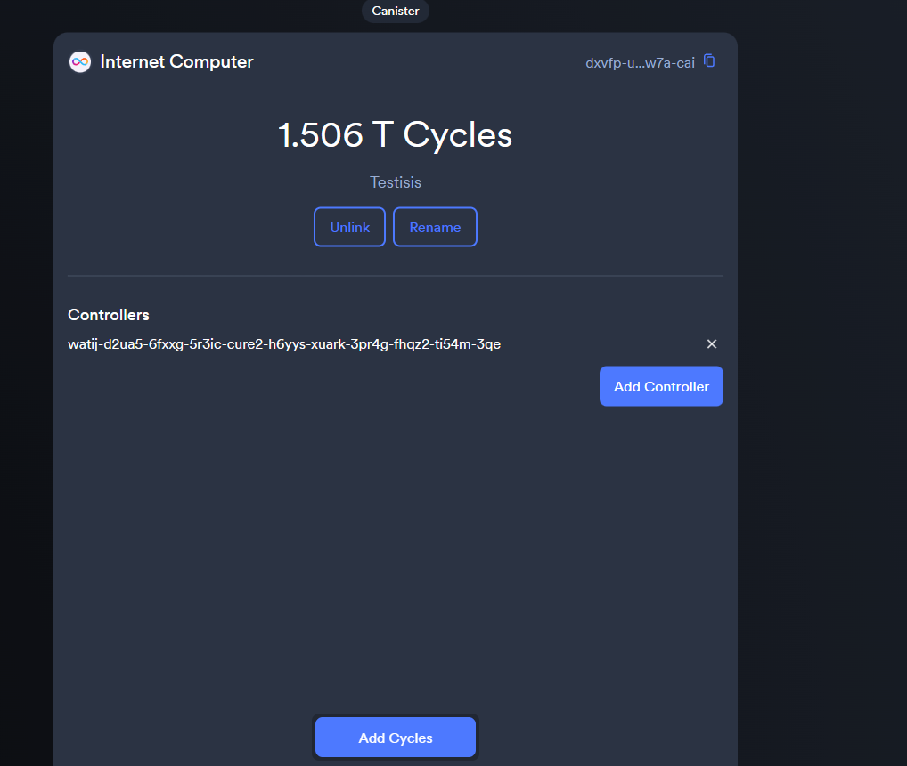
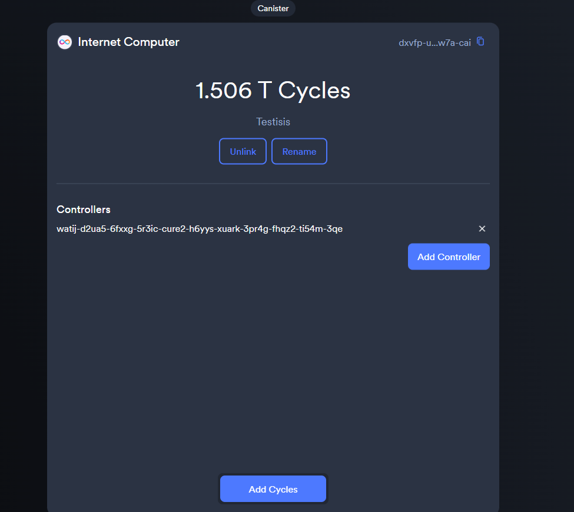

# Quick Start - eSihagBa City Budget Tracker

## TL;DR

**Backend (Motoko)** and **frontend (React + Vite + shadcn)** are set up. Deploy the backend to ICP, run the frontend locally or deploy it, and you're ready.

### Deploy backend to ICP mainnet

```bash
dfx deploy --network ic backend --mode upgrade
```

### Run frontend locally

```bash
cd frontend
npm install
npm run dev
```

Open http://localhost:5173. The app talks to the backend via `frontend/src/lib/icp.ts` (local replica: `http://127.0.0.1:4943`, mainnet: `https://ic0.app`).

---

## Pre-deployment checklist

- Backend: `src/backend/main.mo` (Motoko) – fixed and ready
- Frontend: `frontend/` – React, TypeScript, Vite, shadcn/ui
- Backend canister ID: `yvo33-jqaaa-aaaaf-qbxra-cai` (in `canister_ids.json` and `frontend/src/lib/icp.ts`)
- Deploy: run `dfx deploy --network ic backend --mode upgrade` (or use the scripts below)

---

## Project structure

```
eSihagBaV2/
├── dfx.json                 # DFX config (backend + frontend canisters)
├── canister_ids.json        # Backend canister ID for IC
├── deploy_mainnet.sh        # Unix: deploy backend to ICP
├── deploy_mainnet.bat       # Windows: deploy backend to ICP
├── package.json             # Root (Vercel deploy, etc.)
│
├── src/backend/             # Motoko canisters
│   ├── main.mo              # Deployed backend logic
│   ├── main_complex.mo      # Reference implementation
│   ├── main_simple.mo       # Minimal backup
│   ├── main_backup.mo       # Backup
│   ├── types.mo             # Shared types
│   └── utils.mo             # Utilities
│
└── frontend/                # React + Vite + shadcn
    ├── package.json         # npm scripts (dev, build, lint, preview)
    ├── index.html
    ├── vite.config.ts
    └── src/
        ├── main.tsx
        ├── App.tsx
        ├── lib/icp.ts       # Backend actor + canister ID
        ├── context/BackendContext.tsx
        ├── components/      # Dashboard, Transactions, Wallets, etc.
        ├── pages/
        └── types/
```

---

## How to deploy

### Option 1: Deploy backend only (recommended first step)

**Windows (PowerShell):**

```powershell
cd C:\Users\Administrator\Desktop\eSihagBaV2
dfx deploy --network ic backend --mode upgrade
```

**WSL:**

```bash
wsl
cd /mnt/c/Users/Administrator/Desktop/eSihagBaV2
dfx deploy --network ic backend --mode upgrade
```

**Git Bash:**

```bash
cd /c/Users/Administrator/Desktop/eSihagBaV2
dfx deploy --network ic backend --mode upgrade
```

### Option 2: Use deployment scripts

Scripts check DFX, wallet, and balance, then deploy the backend.

**Unix (Linux/macOS/WSL):**

```bash
./deploy_mainnet.sh
```

**Windows:**

```cmd
deploy_mainnet.bat
```

Note: These run `dfx deploy --network ic backend` (no `--mode upgrade`). For upgrades, use the manual command above.

### Option 3: Deploy backend + frontend to ICP

Build the frontend, then deploy both canisters:

```bash
cd frontend
npm run build
cd ..
dfx deploy --network ic
```

Frontend assets come from `frontend/dist` (see `dfx.json`). After deploy, `canister_ids.json` will include the frontend canister ID.

---

## Run frontend locally

1. Install dependencies and start dev server:

```bash
cd frontend
npm install
npm run dev
```

2. Open http://localhost:5173.

3. Backend connection:
   - **Local**: Start a replica (`dfx start --background`), deploy backend (`dfx deploy backend`). `icp.ts` uses `http://127.0.0.1:4943`.
   - **Mainnet**: Deploy backend to IC first. When not on localhost, `icp.ts` uses `https://ic0.app` and your backend canister ID.

---

## Quick tests

### 1. Backend via CLI

```bash
dfx canister --network ic call backend healthCheck
dfx canister --network ic call backend getSystemStats
```

### 2. Candid UI

https://a4gq6-oaaaa-aaaab-qaa4q-cai.raw.icp0.io/?id=yvo33-jqaaa-aaaaf-qbxra-cai

Try:

- `healthCheck()` → `(true)`
- `getSystemStats()` → stats object
- `registerUser(variant { User }, "Your Name", "your@email.com")` → create user

### 3. Frontend

1. Run `npm run dev` in `frontend/` and open http://localhost:5173.
2. Check connection status (e.g. "Connected to ICP" or similar).
3. Use Profile: register user, create wallet, record transaction.

---

## Backend API overview

### User management

- `whoami()` – current principal (query)
- `registerUser(role, name, email)` – register user

### Wallet management

- `createWallet(address, walletType, label?)` – create wallet
- `getWallet(id)` – get wallet (query)
- `getUserWallets()` – user's wallets (query)
- `getAllWallets()` – all wallets (query, auth)

### Transaction management

- `recordTransaction(...)` – record transaction
- `confirmTransaction(id, blockHeight)` – mark confirmed
- `failTransaction(id, reason)` – mark failed
- `getTransaction(id)` – get one (query)
- `getAllTransactions()` – list all (query)
- `getTransactionsPaginated(page, limit)` – paginated list (query)
- `getTransactionCount()` – total count (query)
- `getTransactionsByAddress(address)` – by address (query)
- `getTransactionsByStatus(status)` – by status (query)

### System

- `getSystemStats()` – stats (query)
- `healthCheck()` – health (query)

---

## Configuration

| What | Where |
|------|--------|
| Backend canister ID | `canister_ids.json`, `frontend/src/lib/icp.ts` |
| Host (local vs mainnet) | `frontend/src/lib/icp.ts` (localhost → `127.0.0.1:4943`, else `ic0.app`) |
| DFX networks | `dfx.json` (e.g. `ic` → `https://ic0.app`) |

If you deploy a new backend canister, update `frontend/src/lib/icp.ts` (`CANISTER_ID`) and redeploy or rebuild the frontend.

---

## If something goes wrong

### Deployment fails

```bash
dfx wallet --network ic balance
dfx canister --network ic status backend
```

Ensure you have cycles and the wallet is configured for `ic`.

### Frontend not connecting

1. Open devtools (F12) and check the console.
2. Confirm `CANISTER_ID` in `frontend/src/lib/icp.ts` matches your backend.
3. For mainnet, use HTTPS and `ic0.app`.
4. For local, ensure `dfx start` and `dfx deploy backend` have been run.

### Backend calls fail

1. Test via Candid UI first.
2. Ensure you're registered (`registerUser`) and use the correct identity.
3. Check roles and permissions (Admin / User / Auditor).

### Local replica issues

```bash
dfx stop
dfx start --clean --background
dfx deploy backend
```

---

## Important files

| File | Purpose |
|------|---------|
| `src/backend/main.mo` | Deployed Motoko backend |
| `src/backend/types.mo` | Shared types |
| `src/backend/utils.mo` | Shared utilities |
| `frontend/src/lib/icp.ts` | Backend actor + canister ID + host |
| `frontend/src/context/BackendContext.tsx` | Backend context for React |
| `dfx.json` | DFX canister config |
| `canister_ids.json` | Canister IDs (backend, and frontend if deployed) |
| `STAGING_AND_PROD.md` | Staging (local) vs production (IC) workflow |

---

## Success criteria

After deployment:

- `healthCheck` and `getSystemStats` work via `dfx` or Candid UI.
- Frontend connects without errors.
- You can register users, create wallets, and record transactions.
- Data persists across calls and upgrades.

---

**Ready to deploy?** Run `dfx deploy --network ic backend --mode upgrade`, then start the frontend with `cd frontend && npm run dev`.
